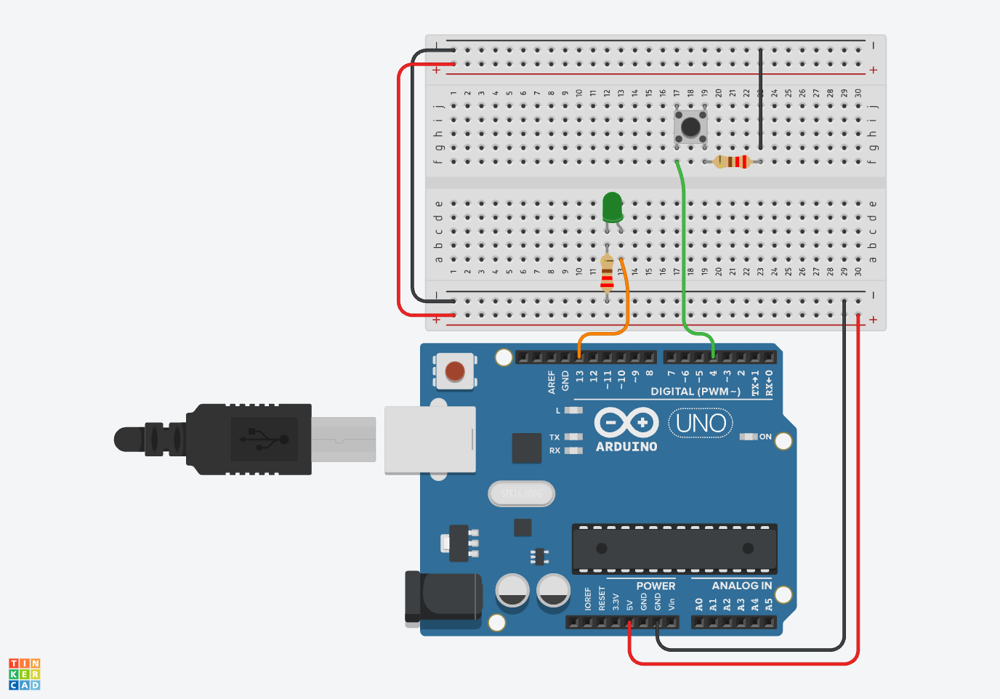

# tinkercad-demo

Tinkercad is a free, easy-to-use app for 3D design, electronics, and coding. To learn more about Tinkercad, visit [Tinkercad](https://www.tinkercad.com/).

## Project Description

This project is a demo of Tinkercad's capabilities. This project is a simple circuit that uses a `pushbutton` to control an LED. The circuit is powered by an Arduino Uno. The LED can operate in two modes: a `steady on` mode and a `blinking` mode. The mode is toggled based on the state of the `pushbutton`.

### Operational modes

- `Steady on` mode: The LED is turned on and remains on until the `pushbutton` is released.
- `Blinking` mode: The LED blinks at a rate of 1 Hz. The LED will continue to blink until the `pushbutton` is pressed.

## Circuit Diagram

The circuit diagram for this project is shown below:

## Components

The components used in this project are:

- Arduino Uno
- Breadboard
- Pushbutton
- LED
- 220 Ohm Resistor
- Jumper Wires
- USB Cable

## Instructions

1. Connect the components as shown in the circuit diagram.
2. Open the `Blinker` code in the Arduino IDE. The code is located in the `src` directory.
3. Upload the code to the Arduino Uno.
4. Press the `pushbutton` to toggle between the `steady on` and `blinking` modes.
5. Observe the LED to see the mode change.

## License

Distributed under the MIT License. See [LICENSE](./LICENSE) for more information.
