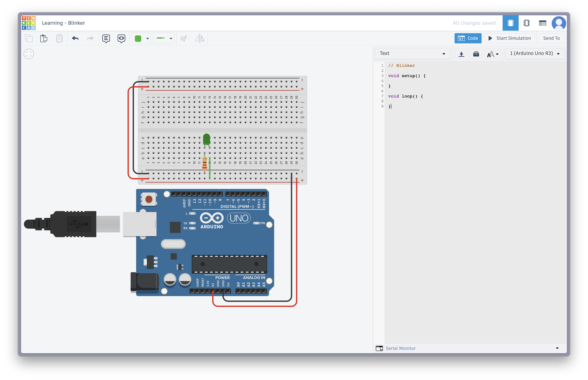
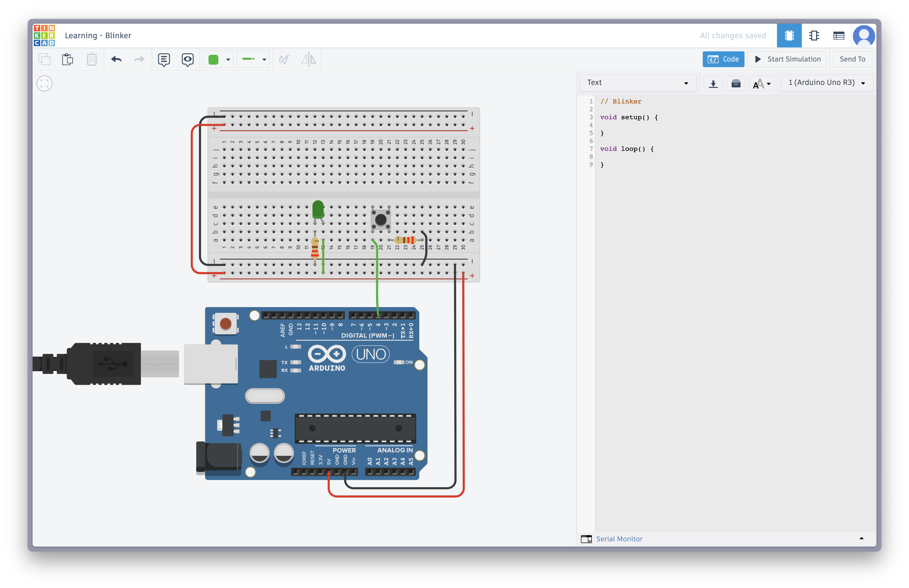
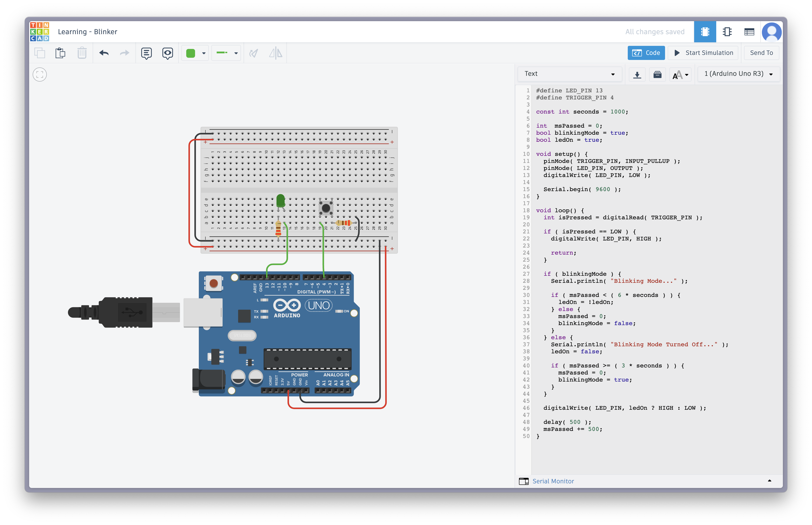

# Step by step guide

This guide will walk you through the process of creating the circuit and code for the Tinkercad demo project.

## Step 1: Create the Circuit

- Connect the ground (GND) pin of the Arduino Uno to the negative rail of the breadboard.
- Connect the 5V pin of the Arduino Uno to the positive rail of the breadboard.
- Place the LED on the breadboard with the longer leg (anode) in the positive rail and the shorter leg (cathode) in the negative rail.
- Connect the 5V of the positive rail to one terminal of the LED.
- Connect the resistor (220 Ω) from the negative rail to the other terminal of the LED.

Up to this point, you should have a simple circuit with an LED connected to the Arduino Uno that looks like this.

## Step 2: Add the Pushbutton

- Place the pushbutton on the breadboard.
- Connect one leg of the `pushbutton` to the `pin 4` of the Arduino Uno.
- Connect the resistor (220 Ω) to the other leg of the `pushbutton` in horizontal.
- Connect a cable to the negative rail of the breadboard and the other end to the same row as the resistor.

At this point, your circuit should look like this.

## Step 3: Rewire Anode and Write the Code

- Connect the anode of the LED to the `pin 13` of the Arduino Uno.
- Open the Tinkercad Arduino IDE.
- Copy the code from `src/blinker.cpp` and paste it into the IDE.
- Upload the code to the Arduino Uno.
- Click on `Start Simulation`.

At this point, your circuit should look like this.

Now, you're ready to start learning more about Tinkercad and experimenting with the circuit. Have fun! 🚀
